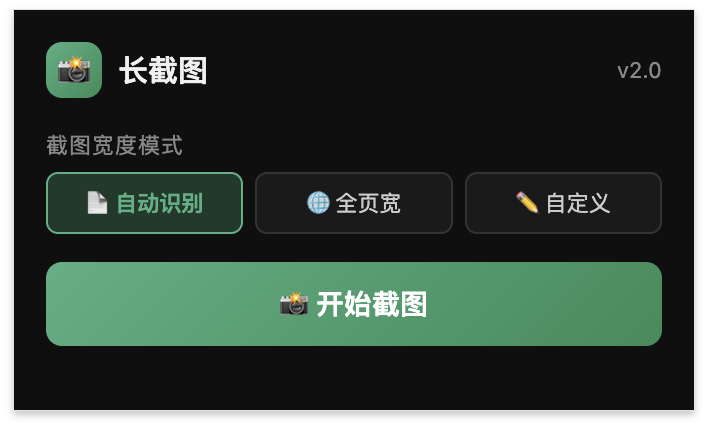
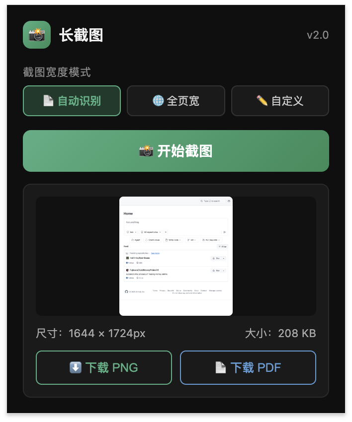

# 网页长截图插件 v2 (Page Screenshot Extension)

一款简单强大且轻量级的 Chrome 网页长截图扩展插件。

## 📸 界面预览

### 插件主界面

### 导出界面

## ✨ 核心功能

- **多种截图宽度模式**：支持自动识别、全页宽、自定义宽度。
- **一键截取长图**：点击“开始截图”即可快速生成并拼接网页高清长图。
- **双格式导出**：截图完成后支持预览，并提供 **PNG 图片** 和 **PDF 文档** 两种下载方式。
- **界面简洁易用**：极简的弹出面板，一键操作，开箱即用。

## 🚀 安装指南

1. 下载或克隆本仓库代码到本地。
2. 打开 Google Chrome 浏览器，在地址栏输入 `chrome://extensions/` 进入扩展程序管理页面。
3. 开启页面右上角的 **开发者模式 (Developer mode)**。
4. 点击左上角的 **加载已解压的扩展程序 (Load unpacked)**，然后选择本插件所在的文件夹。

## 💡 使用方法

1. 在 Chrome 浏览器工具栏中点击本插件的图标（相机图标）。
2. 在弹出的界面中选择你需要的“截图宽度模式”。
3. 点击 **开始截图**，插件会自动滚动并拼接页面，生成长截图。
4. 截图完成后，在预览界面查看长图尺寸和大小，并选择 **下载 PNG** 或 **下载 PDF**。

## 📄 开源协议

本项目采用 [MIT License](LICENSE) 协议进行开源。